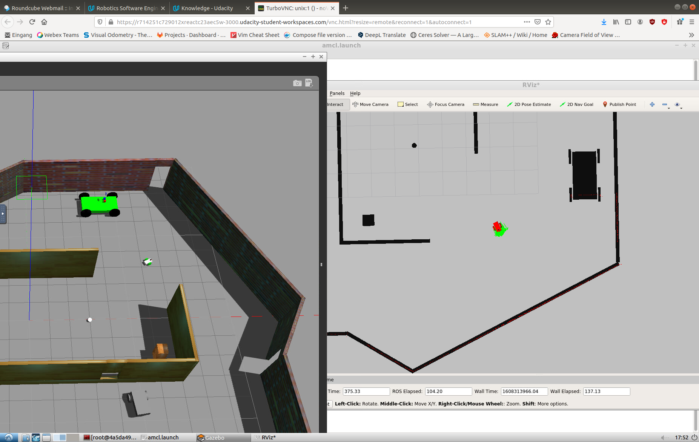

# UD_WHERE_AM_I
A project of Udacity Nano-degree Robotics Software Engineer. Robot localization (AMCL) using ROS and Gazebo simulation.

## Installation
```
cd catkin_ws/src/
git clone https://github.com/gauti1311/UD_WHERE_AM_I
```
## Build
```
cd ~/catkin_ws
caktin_make
```
## Run the Project
open a termnial
```
cd catkin_ws
source devel/setup.bash
roslaunch my_robot world.launch
```
in another terminal 
```
cd catkin_ws
source devel/setup.bash
roslaunch my_robot amcl.launch
```

To run teleop node
```
rosrun teleop_twist_keyboard teleop_twist_keyboard.py 
```
  
